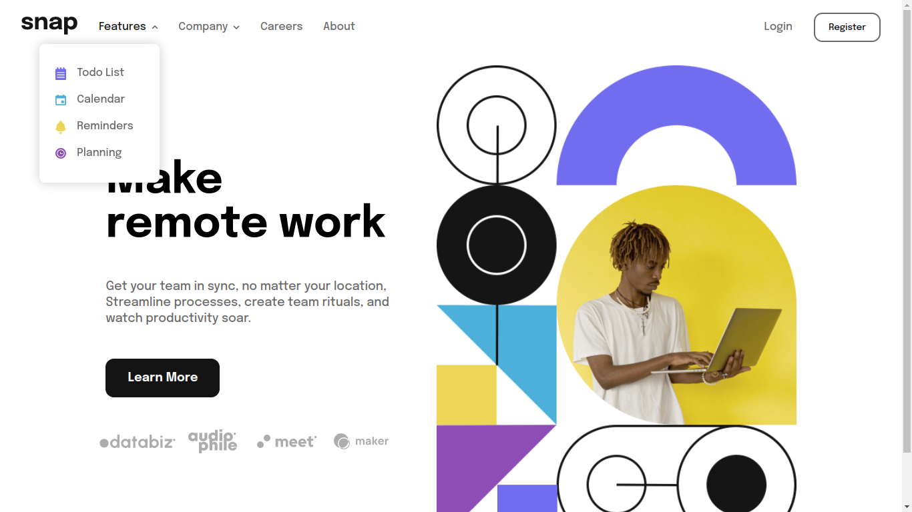
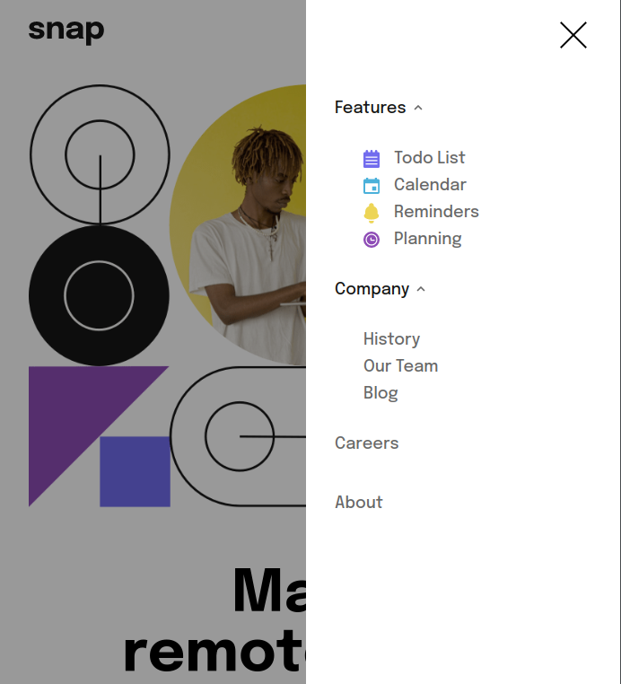

<div align="center">
  
  <h1>Dropdown Section Navigation</h1>
  <h4>Challenge from <a href="https://www.frontendmentor.io/challenges/intro-section-with-dropdown-navigation-ryaPetHE5">Frontend Mentor</a></h4>


   [](https://dropdown-section-navigation-react.vercel.app/)

   
   
</div>

## ❔ About this Project

Project developed by [DanteBenicio](https://github.com/DanteBenicio)

> Status: Production

It's a project created to better productivity on your work 💢


## 🚀 Run the project

```bash
# Clone the project from Github
git clone https://github.com/DanteBenicio/dropdown-section-navigation-react

# Access the project folder
cd dropdown-section-navigation-react

# Install the project dependencies
yarn
or
npm install

# Run the project (port 3000 - http://localhost:3000)
yarn dev
or
npm run dev
```